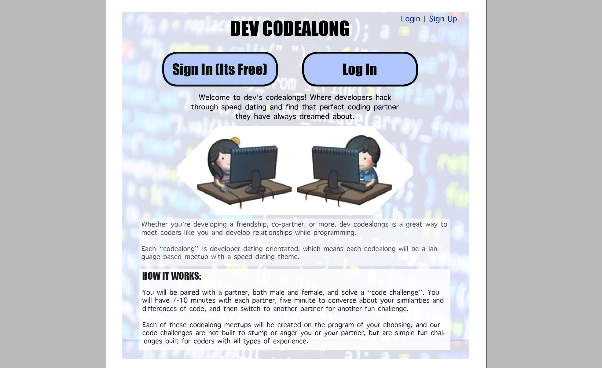
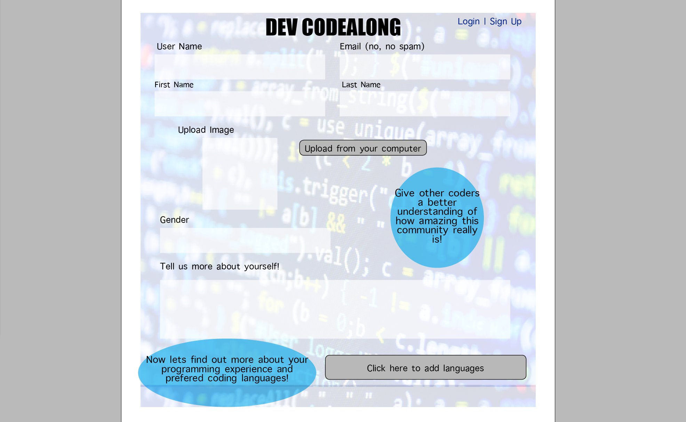
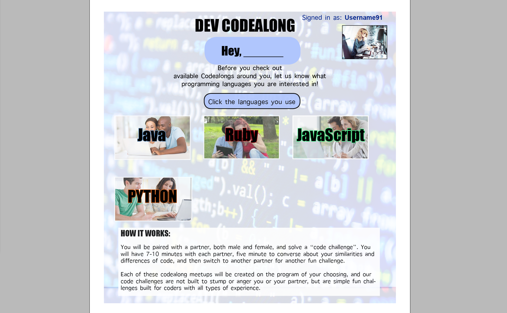
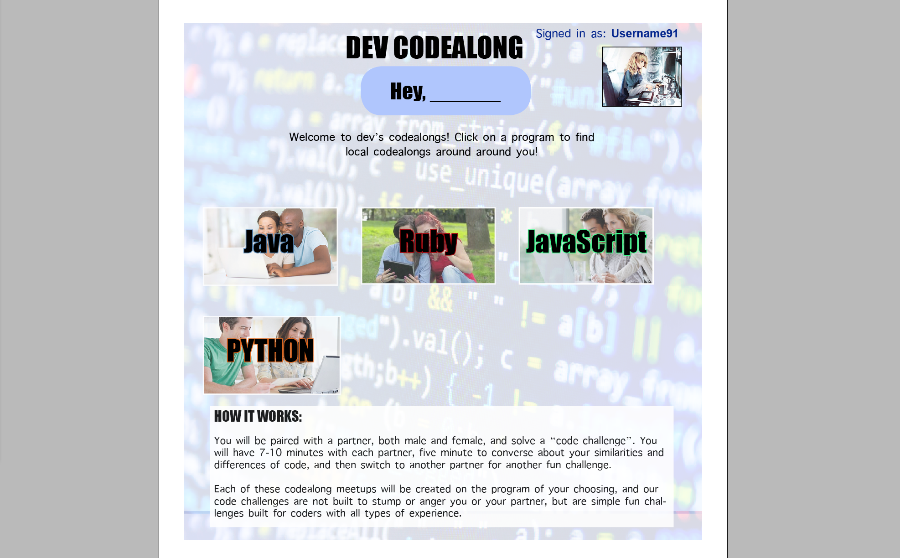
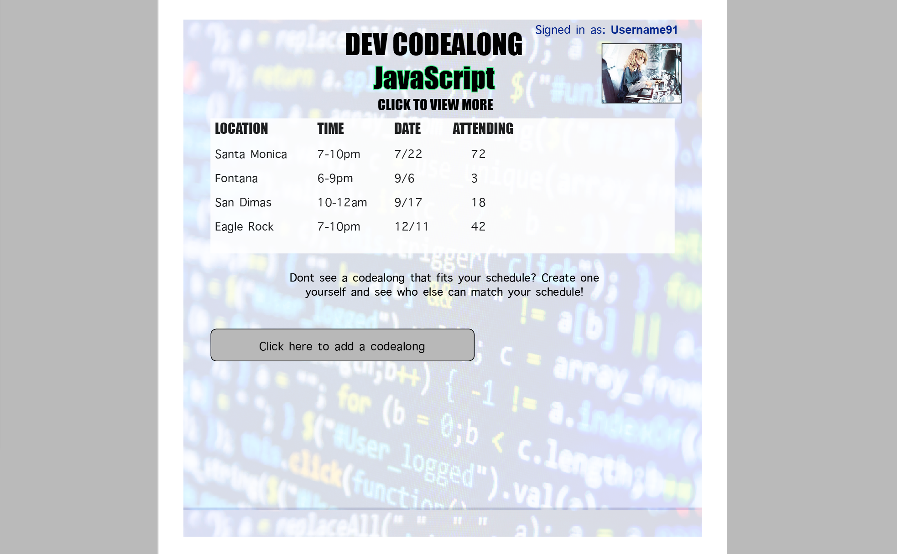
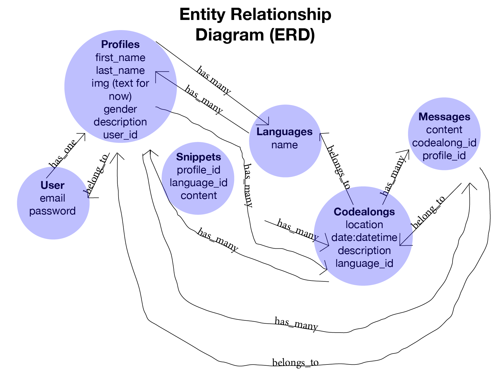

#A Ruby on Rails 4 Application

#Creating a developers dating site

###Link to hosted app: https://devcodealongs.herokuapp.com/

###Link to Trello: http://bit.ly/2ahp3b1

###Installation/Startup Instructions: deploy on Heroku

#####Welcome to dev’s codealongs! Where developers hack through speed dating and find that perfect coding partner they have always dreamed about.

#####Whether you’re developing a friendship, co-partner, or more, dev codealongs is a great way to meet coders like you and develop relationships while programming.

#####Each “codealong” is developer dating orientated, which means each codealong will be a language based meetup with a speed dating theme.

#How it works:
- You will be paired with a partner, both male and female, and solve a “code challenge”. You will have 7-10 minutes with each partner, five minute to converse about your similarities and differences of code, and then switch to another partner for another fun challenge.
- Each of these codealong meetups will be created on the program of your choosing, and our code challenges are not built to stump or anger you or your partner, but are simple fun challenges built for coders with all types of experience.

###WireFrames

- Main Page

- Fill Out Form

- Picking A Language

- Picking A Codealong

- A List Of Data Input

- View Data (Codealong)

##ERD
- ERD

##Models:

###Users:
- Username: string
- Password: string

###Profiles:
- User_id:
- First_name
- Last_name
- Img: string (used with magick with paperclip)
- Gender: string
- Description: string

###Snippet
- Profile_id
- language_id
- Content

###Language
- Ruby
- JavaScript
- HTML/CSS
- Java
- Python

###Messages:
- Title: string
- Content: string

###Codealongs:
- Language_id
- Location: string
- Date: datetime
- Description

##Joined Tables :
(these are single because each record of messages/profiles has one ID)

###Messages_pr]ofiles :
- Profile_id
- Message_id

###Codealongs_profiles :
- Profile_id
- Codealong_id

###Technologies Used
- RubyOnRails4
- HTML/CSS/JavaScript
- MIIRKAT AWESOMENESS

###Unsolved Problems/Next Steps:

- I would like to filter out codealong locations to be locations of my user’s desire (city) so that the user could find the codealongs that are close by where the user live.
- I want the user to be able to make a profile so that the user can show other users who he or she is and what type of code they know.
- I would like to add more languages.
- I want to be able to filter by language of the user’s choice so that the user does not have a page full language that the user is not interested in or have no experience with.
- I want to be able to block individuals who the user does not wish to talk to.
- I want to be able to have a “codealong” that the user can pair up online with an individual to work on so that the user is not limited to only going to a meetup to meet people. I want the user to be able to chat with another person online in real time in order to work together.

---

##Approach Taken: Domain Modeling

##EVENT ACTIONS

###Installation/StartUp Instructions
