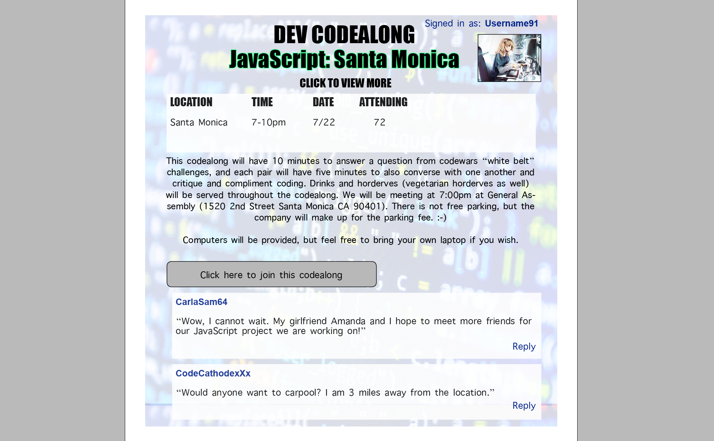

#A Ruby on Rails 4 Application

#Creating a developers dating site

####Link to page: http://bit.ly/2afoH8N

####Link to Trello board: https://trello.com/b/vfUisobc/project-2

#####Welcome to dev’s codealongs! Where developers hack through speed dating and find that perfect coding partner they have always dreamed about.

#####Whether you’re developing a friendship, co-partner, or more, dev codealongs is a great way to meet coders like you and develop relationships while programming.

#####Each “codealong” is developer dating orientated, which means each codealong will be a language based meetup with a speed dating theme.

#How it works:
- You will be paired with a partner, both male and female, and solve a “code challenge”. You will have 7-10 minutes with each partner, five minute to converse about your similarities and differences of code, and then switch to another partner for another fun challenge.
- Each of these codealong meetups will be created on the program of your choosing, and our code challenges are not built to stump or anger you or your partner, but are simple fun challenges built for coders with all types of experience.

###WireFrames

- Main Page

- Fill Out Form

- Picking A Language

- Picking A Codealong

- A List Of Data Input

- View Data (Codealong)

##ERD
- ERD

##Models:

###Users:
- Username: string
- Password: string 

###Profiles:
- User_id:
- First_name
- Last_name
- Img: string (used with magick with paperclip)
- Gender: string
- Description: string

###Snippet
- Profile_id
- language_id
- Content

###Language
- Ruby
- JavaScript
- HTML/CSS
- Java
- Python

###Messages:
- Title: string
- Content: string

###Codealongs:
- Language_id
- Location: string
- Date: datetime
- Description

##Joined Tables :
(these are single because each record of messages/profiles has one ID)

###Messages_pr]ofiles :
- Profile_id
- Message_id

###Codealongs_profiles :
- Profile_id
- Codealong_id

###Technologies Used
- RubyOnRails4
- HTML/CSS/JavaScript

---

##Approach Taken: Domain Modeling

##EVENT ACTIONS

###Installation/StartUp Instructions
